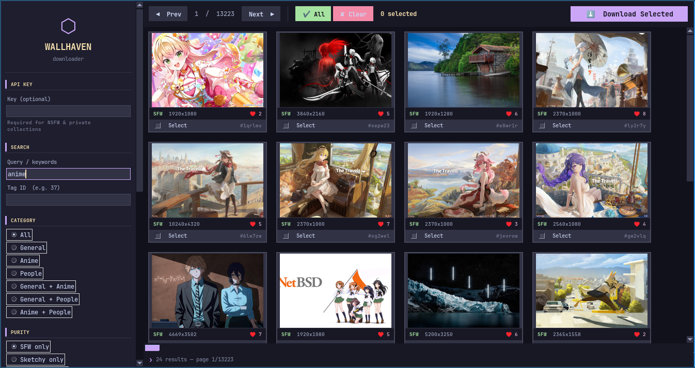

#+TITLE: waldl-gui
#+SUBTITLE: A wallhaven.cc wallpaper browser & downloader
#+AUTHOR: Touhidul Shawan
#+OPTIONS: toc:2 num:nil ^:nil

#+html: 

#+html: <h1>⬡ waldl-gui</h1>
#+html: 
A cross-platform desktop GUI for searching and downloading wallpapers from <a href="https://wallhaven.cc">wallhaven.cc</a>

#+html:  
#+html: 

#+begin_quote
This is made with AI. 
Already I have made a script previously related to this project called (github) [[https://github.com/touhidulshawan/waldl][waldl]] (codeberg) [[https://codeberg.org/touhidulshawan/waldl][waldl]]. You can check that out.
#+end_quote

* Table of Contents :toc:
- [[#features][Features]]
- [[#requirements][Requirements]]
- [[#installation][Installation]]
  - [[#option-a--run-from-source][Option A — Run from source]]
  - [[#option-b--build-a-standalone-binary-no-python-required-to-run][Option B — Build a standalone binary (no Python required to run)]]
- [[#api-key][API Key]]
- [[#usage][Usage]]
  - [[#searching][Searching]]
  - [[#filters][Filters]]
  - [[#selecting--downloading][Selecting & downloading]]
  - [[#save-directory][Save directory]]
- [[#project-structure][Project Structure]]
- [[#building-from-source--troubleshooting][Building from source — troubleshooting]]
  - [[#tkinter-import-error-during-build][=tkinter= import error during build]]
  - [[#pyinstaller-not-found][=pyinstaller= not found]]
  - [[#binary-crashes-on-a-different-machine][Binary crashes on a different machine]]
  - [[#slow-thumbnail-loading][Slow thumbnail loading]]
- [[#license][License]]

* Features

- Search by keyword, tag query, or numeric Tag ID
- Filter by category (General / Anime / People)
- Purity filter — SFW, Sketchy, NSFW (NSFW requires API key)
- Resolution, aspect ratio, and accent colour filters
- Minimum image size (W × H)
- Sorting by date, relevance, views, favorites, toplist
- Lazy-loading thumbnail grid with pagination
- Per-image checkboxes with Select All / Clear
- Bulk download of selected images
- Live status log bar showing API requests and responses

* Requirements

| Requirement | Version  |
|-------------|----------|
| Python      | ≥ 3.9    |
| requests    | ≥ 2.28.0 |
| Pillow      | ≥ 9.0.0  |
| tkinter     | bundled with Python (see notes) |

* Installation

** Option A — Run from source

This is the quickest way to get started.

*** 1. Clone the repository
**** Github
#+begin_src sh
git clone https://github.com/touhidulshawan/waldl-gui.git
cd waldl-gui
#+end_src
**** Codeberg
#+begin_src sh
git clone https://codeberg.org/touhidulshawan/waldl-gui.git
cd waldl-gui
#+end_src

*** 2. Install Python dependencies

#+begin_src sh
pip install -r requirements.txt
#+end_src

*** 3. Install tkinter (Linux only — usually missing)

#+begin_src sh
# Debian / Ubuntu / Mint / Pop!_OS
sudo apt install python3-tk

# Fedora / RHEL / CentOS
sudo dnf install python3-tkinter

# Arch / Manjaro
sudo pacman -S tk

# openSUSE
sudo zypper install python3-tk
#+end_src

On *Windows* and *macOS*, tkinter ships with the official Python installer from
[[https://python.org]] — no extra step needed.

*** 4. Launch

#+begin_src sh
python main.py
#+end_src

** Option B — Build a standalone binary (no Python required to run)

The build script creates a single self-contained executable using PyInstaller.
You only need Python on the *build machine* — the resulting binary runs anywhere.

*** Linux

#+begin_src sh
chmod +x build.sh
./build.sh
#+end_src

Output: =dist/WallhavenDownloader=

A convenience launcher is also created at =./run.sh=.

To install system-wide and add to your application menu:

#+begin_src sh
sudo ./install.sh
#+end_src

After that you can launch the app from your desktop environment's app launcher
(listed under Graphics / Network) or from any terminal:

#+begin_src sh
waldl-gui
#+end_src

*** Windows

Double-click =build.bat= or run it in Command Prompt:

#+begin_src bat
build.bat
#+end_src

Output: =dist\WallhavenDownloader.exe=

To pin it to the Start Menu or taskbar, right-click the =.exe= and choose
/Create shortcut/, then drag the shortcut wherever you like.

* API Key

An API key is *optional* for SFW content, but *required* for:

- Sketchy or NSFW purity levels
- Accessing your private collections or favorites
- Higher rate limits

To get one:

1. Create a free account at [[https://wallhaven.cc]]
2. Go to [[https://wallhaven.cc/settings]] → API tab
3. Copy your key and paste it into the *API Key* field in the sidebar

The key is never stored on disk — you will need to re-enter it each session.

* Usage

** Searching

1. Type a keyword or tag name into the *Query / keywords* field, or enter a
   numeric *Tag ID* (found in wallhaven.cc URLs, e.g. =/tag/37= → enter =37=)
2. Adjust filters in the sidebar as needed
3. Press *Enter* or click the *SEARCH* button

Results appear as a thumbnail grid. Use *Prev* / *Next* to page through them.

** Filters

| Filter      | Description                                              |
|-------------|----------------------------------------------------------|
| Category    | General, Anime, People — any combination                |
| Purity      | SFW / Sketchy / SFW+Sketchy (NSFW needs API key)        |
| Sort by     | Date added, relevance, random, views, favorites, toplist |
| Order       | Descending or ascending                                  |
| Top range   | Time window for toplist sorting (1d → 1y)               |
| Resolution  | Exact resolution preset                                  |
| Ratio       | Aspect ratio (16:9, 4:3, 21:9 …)                        |
| Accent colour | Filter by dominant colour                              |
| Min W × H   | Minimum image dimensions in pixels                       |

** Selecting & downloading

1. Tick the *Select* checkbox on any thumbnail — or click *✔ All* to select
   everything on the current page
2. Navigate to other pages and select more if needed
3. Click *⬇ Download Selected*
4. All checked images on the *current page* are downloaded to your chosen
   save directory

#+begin_quote
*Note:* selections persist while you paginate, but downloads only process
images visible on the current page. Download page by page when selecting
across multiple pages.
#+end_quote

** Save directory

Click the *…* button next to the save path field to browse for a folder.
The default is =~/Pictures/Wallhaven=. The folder is created automatically if it does
not exist. Files that already exist are skipped (no re-downloads).

* Project Structure

#+begin_src
waldl-gui/
├── main.py              # Application source
├── requirements.txt     # pip dependencies
├── pyproject.toml       # pip-installable package metadata
├── build.sh             # Linux build script (PyInstaller)
├── build.bat            # Windows build script (PyInstaller)
├── install.sh           # Linux system-wide install + desktop entry
├── wallhaven.desktop    # Linux .desktop file (app menu integration)
└── README.org           # This file
#+end_src

* Building from source — troubleshooting

** =tkinter= import error during build

#+begin_src
ModuleNotFoundError: No module named 'tkinter'
#+end_src

Install the system package for your distro (see [[*Install tkinter (Linux only — usually missing)][Install tkinter]] above), then
re-run the build script.

** =pyinstaller= not found

The build script installs PyInstaller automatically inside an isolated venv.
If it still fails, install it manually:

#+begin_src sh
pip install pyinstaller
#+end_src

** Binary crashes on a different machine

Make sure both machines are running the same OS major version (e.g. Ubuntu 22
binary may not run on Ubuntu 18). For maximum compatibility, build on the
*oldest* OS version you intend to support.

** Slow thumbnail loading

Wallhaven.cc applies rate limiting to unauthenticated requests. Adding an API
key in the sidebar significantly improves throughput.

* License

MIT — do whatever you want with it.
